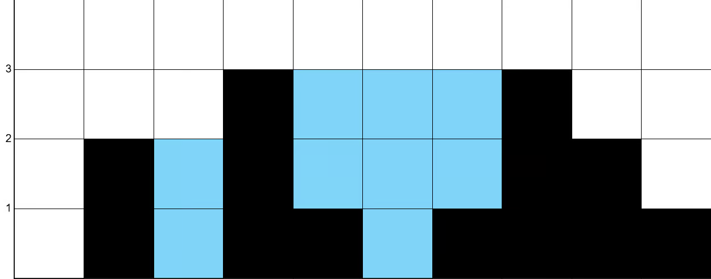

!!! note ""
    You are given an array of non-negative integers height which represent an elevation map. Each value `height[i]` represents the height of a bar, which has a width of 1.

    Return the maximum area of water that can be trapped between the bars.

    ### Examples

    | Example | Input | Output | Explanation |
    | --- | --- | --- | --- |
    | 1 | `[0,2,0,3,1,0,1,3,2,1]` | `9` |  The water can be trapped between the bars at index 1 and index 7. |

    ### Constraints
    - `1 <= height.length <= 1000`
    - `0 <= height[i] <= 1000`

## Analysis

Even if it looks similar to the previous problem, it's a bit more complex. Mainly because in the previous problem we had to choose any two bars and get the area, while here we have to consider all the bars and how much water can be trapped between them.

We can start from 0 and 1, and try to use some sort for raycasting (by projecting the left bar onto the right bar), but it would be O(n^2) time complexity as we would still have to calculate the area for each pair and subtract the heights, not optimal. We can do better.

Let's think about water calculation better: at every position i, the amount of water that can be trapped at that position is determined as before by the maximum height to the left and the maximum height to the right. But we need to make sure we subtract the height of the bar at that position.
However, we can't just calculate the maximum height to the left and right for every position, as it would be O(n^2) time complexity again. We can instead pre-calculate them.

We can create one array of length n, where the i-th element of the array represents the max height to the left. Same thing for the right. Then we'll only iterate once more through the original array and sum the water.

I'm not gonna lie, I drafted my solution and submitted it just to get a negative value as output. This makes sense since I'm subtracting the height of the bar at each position, which could result in a negative value if the bar is taller than the maximum heights to its left and right. I then checked the solution and realized there was none of that -> time to reverse engineer the official solution.

**My prefix/suffix arrays store the maximum strictly to the left/right of each index, while the official solution's arrays store the maximum including the current index itself.**

I personally think that for understanding the problem, my version is more intuitive. You can go to a position, look to the left and right, and see how much water can be trapped at that position. Including the current index in the prefix/suffix arrays is a bit counter-intuitive when running through the example, but it is technically more efficient as we don't have to check for negatives.

My version
left:  [0, 0, 2, 2, 3, 3, 3, 3, 3, 3]
right: [3, 3, 3, 3, 3, 3, 3, 2, 1, 0]

Official version
left:  [0, 2, 2, 3, 3, 3, 3, 3, 3, 3]
right: [3, 3, 3, 3, 3, 3, 3, 3, 2, 1]

## Solution

=== "Python"

        :::python
        class Solution:
            def trap(self, height: List[int]) -> int:
                n = len(height)
                ans = 0

                maxLeftPrefix = [0] * n
                maxLeft = 0
                for i in range(1, n):
                    maxLeft = max(maxLeft, height[i - 1])
                    maxLeftPrefix[i] = maxLeft

                maxRightPrefix = [0] * n
                maxRight = 0
                for i in range(n - 2, -1, -1):
                    maxRight = max(maxRight, height[i + 1])
                    maxRightPrefix[i] = maxRight

                for i in range(n):
                    water = min(maxLeftPrefix[i], maxRightPrefix[i]) - height[i]
                    ans += max(0, water)

                return ans

=== "Java"

        :::java
        class Solution {
            public int trap(int[] height) {
                int n = height.length;
                int ans = 0;

                int[] maxLeftPrefix = new int[n];
                int maxLeft = 0;

                for (int i = 1; i < n; i++) {
                    maxLeft = Math.max(maxLeft, height[i - 1]);
                    maxLeftPrefix[i] = maxLeft;
                }

                int[] maxRightPrefix = new int[n];
                int maxRight = 0;

                for (int i = n - 2; i > -1; i--) {
                    maxRight = Math.max(maxRight, height[i + 1]);
                    maxRightPrefix[i] = maxRight;
                }

                int water = 0;
                for (int i = 0; i < n; i++) {
                    water = Math.min(maxLeftPrefix[i], maxRightPrefix[i]) - height[i];
                    ans += Math.max(0, water);
                }

                return ans;
            }
        }

### Complexity

- **Time**: $O(n)$ _as we iterate the 3 times: once to calculate the prefix, once to calculate the suffix, and once to calculate the water_
- **Space**: $O(n)$ _as we are storing 2 arrays of length $n$ (prefix and suffix)_

!!! note ""
    where $n$ is the length of the input array
