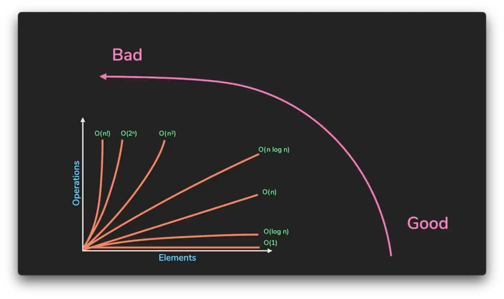

A few fundamentals that aren't tied to any one data structure but come up constantly anyway - as the framing for a coding problem, in system-design-adjacent questions, or as an interview question in their own right.

This section is not exhaustive at all: it just contains minimum information about the topics, enough to get the gist of them, but is not intended as a complete explanation or guide.

## Big-O Notation

Big-O describes how an algorithm's runtime or space grows as the input size ($n$) grows - the shape of the curve, not an exact operation count. It's what makes two different solutions to the same problem comparable, independent of hardware.

**Common complexity classes, best to worst:**

| Notation | Name | Example |
|---|---|---|
| $O(1)$ | Constant | Array index access, hash map lookup |
| $O(\log n)$ | Logarithmic | Binary search |
| $O(n)$ | Linear | Single loop over the input |
| $O(n \log n)$ | Linearithmic | Efficient sorting (merge sort, heapsort) |
| $O(n^2)$ | Quadratic | Nested loop over the input |
| $O(2^n)$ | Exponential | Unpruned recursive subset/subproblem exploration |
| $O(n!)$ | Factorial | Brute-force permutations |

**Rules of thumb:**

- Drop constants: $O(2n)$ is $O(n)$
- Drop lower-order terms: $O(n^2 + n)$ is $O(n^2)$
- Sequential steps add, then take the dominant term: an $O(n)$ pass followed by an $O(n^2)$ pass is $O(n^2)$ overall
- Nested loops multiply: a loop of $O(n)$ inside a loop of $O(m)$ is $O(n \cdot m)$
- Different inputs get different variables: two separate arrays of size `a` and `b`, scanned separately, is $O(a + b)$ - not $O(n)$

## API Design

- REST is resource-oriented: URLs name **nouns** (`/users/123/orders`), the HTTP method supplies the verb
- **HTTP methods:** `GET` (read, safe, idempotent), `POST` (create, not idempotent), `PUT` (replace, idempotent), `PATCH` (partial update, not necessarily idempotent), `DELETE` (remove, idempotent)
- **Idempotent** means calling it once or `N` times leaves the system in the same state. `GET`/`PUT`/`DELETE` are idempotent by convention; `POST` is not
- **Status codes:** `2xx` success (`200` OK, `201` Created, `204` No Content), `4xx` client error (`400` bad request, `401` unauthenticated, `403` unauthorized, `404` not found, `409` conflict), `5xx` server error
- **Statelessness:** each request carries everything needed to process it - no server-side session state between requests
- **Versioning:** in the URL (`/v1/users`), a header, or content negotiation - URL versioning is the most common and easiest for clients to reason about
- **Pagination:** offset-based (`?page=2&size=20`, simple but breaks under concurrent inserts) vs cursor-based (`?after=<id>`, stable under concurrent writes, standard for large or real-time datasets)

### Python

- `FastAPI`/`Flask` map routes to functions; FastAPI additionally validates request/response bodies against Pydantic models and generates OpenAPI docs for free
- Path parameters are declared inline: `@app.get("/users/{id}")`

### Java

- Spring: `@RestController` plus `@GetMapping`/`@PostMapping`/etc. map HTTP methods directly to handler methods
- `@RequestBody`/`@PathVariable`/`@RequestParam` bind request data; `@Valid` handles input validation declaratively

## OOP: Object Oriented Programming

- **Class vs instance:** a class is the blueprint; an object is a specific instance with its own state
- **Encapsulation:** bundling data with the methods that operate on it, hiding internal state behind a public interface
- **Abstraction:** exposing only what's relevant to the caller, hiding implementation detail
- **Inheritance:** a subclass reuses and extends a superclass's behavior
- **Polymorphism:** the same method call behaves differently depending on the actual runtime type
- **Composition over inheritance:** favor "has-a" over "is-a" when behavior needs to be mixed and matched - deep hierarchies get fragile fast

### Python

- No enforced access modifiers - `_protected` and `__private` (name-mangled) are conventions, not hard restrictions
- Multiple inheritance is supported directly; method resolution order follows C3 linearization
- Duck typing: an object's suitability is defined by the methods/attributes it has, not its declared type - `Protocol` gives this structural typing a name without requiring inheritance
- No `interface` keyword - `abc.ABC` + `@abstractmethod` is the closest equivalent

        :::python
        from abc import ABC, abstractmethod

        class Shape(ABC):
            @abstractmethod
            def area(self):
                ...

        class Circle(Shape):
            def __init__(self, r):
                self.r = r

            def area(self):
                return 3.14159 * self.r ** 2

### Java

- Access modifiers (`private`, `protected`, `public`, package-private) are enforced by the compiler
- Single inheritance for classes, but a class can implement multiple `interface`s
- Interfaces (with default methods, since Java 8) are the primary way to define a contract independent of implementation
- Polymorphism is resolved via dynamic dispatch - the JVM picks the actual method implementation at runtime based on the object's real type

        :::java
        interface Shape {
            double area();
        }

        class Circle implements Shape {
            private final double r;
            Circle(double r) { this.r = r; }
            public double area() { return Math.PI * r * r; }
        }