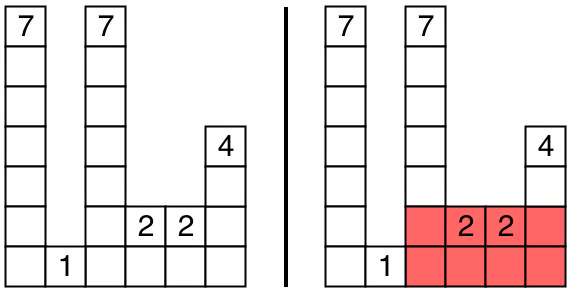
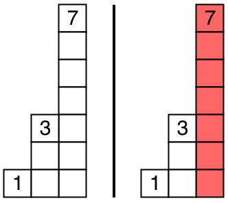

!!! note ""
    You are given an array of integers `heights` where `heights[i]` represents the height of a bar. The width of each bar is 1.

    Return the area of the largest rectangle that can be formed among the bars.

    ### Examples

    | Input | Output | Explanation |
    | --- | --- | --- |
    | `[7,1,7,2,2,4]` | `12` |  The largest rectangle has an area of 12 |
    | `[1,3,7]` | `7` |  The largest rectangle has an area of 7 |

    ### Constraints
    - `1 <= heights.length <= 1000`
    - `0 <= heights[i] <= 1000`

## Analysis

TODO

## Solution

=== "Python"

        :::python

=== "Java"

        :::java

## Complexity

- Time Complexity: $O()$ time complexity _as we _
- Space Complexity: $O()$ space complexity _as we _

!!! note ""
    where $n$ is 
