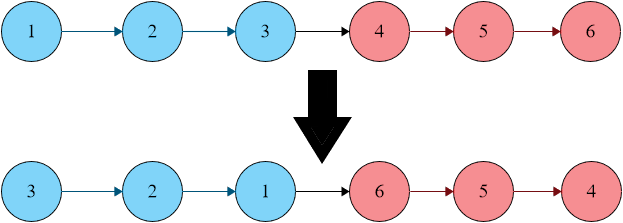

!!! note ""
    You are given the head of a singly linked list `head` and a positive integer `k`.

    You must reverse the first `k` nodes in the linked list, and then reverse the next `k` nodes, and so on. If there are fewer than `k` nodes left, leave the nodes as they are.

    Return the modified list after reversing the nodes in each group of `k`.

    You are only allowed to modify the nodes' `next` pointers, not the values of the nodes.

    ### Examples

    | Input | Output |
    | --- | --- |
    | `head = [1,2,3,4,5,6]`, `k = 3`     | `[3,2,1,6,5,4]` |
    | `head = [1,2,3,4,5]`, `k = 3`     | `[3,2,1,4,5]` |

    ### Constraints
    - The length of the linked list is `n`
    - `1 <= k <= n <= 5000`
    - `0 <= Node.val <= 100`

## Analysis

Before we dive into the implementation, let's focus on what we are actually supposed to do and how the indices should change.

Sneak peak at the recommended time and space complexities, we must solve in $O(n)$ time and $O(1)$ space. This immediately excludes any helper data structures -> we must reverse in-place. The immediate risk here is that we start reversing, modify the list and realize there are less than `k` nodes: this would require to revert the changes, a mess.

We can easily solve this first issue by just scanning the list first and check if there are `k` nodes left, if yes then loop the list again and reverse those `k` nodes. This means we go through the list twice, so $O(2n)$ -> $O(n)$. So we're good from a time perspective.

How do we perform the reversing though? To fully visualize this, I forgot for a moment about the k-groups and checked how we can reverse an entire linked list.

We need to keep track of two main nodes, call them `prev` and `curr`, self explanatory. We set `prev = null` and `curr = head`, and we then start swapping pointers: for a given node, we need to update its `next` pointer so that it points to the previous node, update previous node and finally move to the successive node. We of course need to pay extra attention to intermediate results before we overwrite the pointers (see `temp` below).

    :::
    temp = curr.next
    curr.next = prev
    prev = curr
    curr = temp

For an entire list reversal we stop once `curr == null`, meaning we have reached the rightmost node - but again pay attention here: we need to assign a new `head` otherwise we lose track of it.

Now that the basic algorithm is clear we know what to do, but with a small tweak: the first loop check if we have `k` values, but we can also use that as a stopping condition (we stop when `curr == kth`).

## Solution

=== "Python"

        :::python

=== "Java"

        :::java

## Complexity

- **Time**: $O()$ _as we _
- **Space**: $O()$ _as we _

!!! note ""
    where $n$ is 
