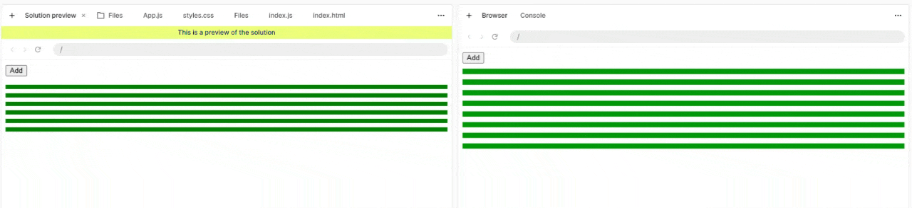

!!! note ""
    Build an app where clicking the "Add" button adds progress bars to the page. The progress bars fill up gradually as soon as they are shown.

    ### Requirements
    - Clicking on the "Add" button adds a progress bar to the page.
    - Each progress bar starts filling up smoothly as soon as it's added.
    - Each bar takes approximately 2000ms to completely fill up.

## Analysis

Unfortunately we cannot create new files so I had to implement the components in one file.

First things first, let's create the `ProgressBar` component with a state to track its progress. But we should also take into account that we can add as many bars as we want, so we also need to track the status of the bars with an array. `addProgressBar` function just takes the current bars and adds a new one with a random id as key.

We then need to find a way to pass the progress to the HTML component so that it renders correcty, we can just use 2 nested `divs` and assign 2 different classes, one for the baseline and one for the progress. Use template literal with JSX inline styling for that: ``style={{ width: `${progress}%` }}``.

We then need to set this `progress` correctly, and of course the first idea was to just use `setTimeout` with 2000 and then set the progress to 100. This obviously does not work as intended because the change will be immediate. We have 2 options then:

- use CSS for that with a `transition` on `width` property with a predefined duration of 2 seconds. This is quite easy but not super flexible (animation will always be 2 seconds, no matter of the progress) and most likely not what the problem want us to focus on
- use `setInterval` with 1 progress in 2000 ms, so every $2000 / 100 = 20 ms$ add 1 to the `progress`

In both cases, the `useEffect` hook is crucial because we need something to be executed as soon as the element mounts. In the first case we just set the progress to 100 and CSS will handle the animation. In the second case, we use `setInterval` to repeat the `setProgress` call every 20 ms. We need to be careful on when to stop, in this case at 100, and clear the timeout so that we stop repeating the call.

This is a premium problem so no solution available, but judging by the end result the solutions look almost identical (bad GIF fps, they're much smoother):

## Solution - With CSS

=== "App.js"

        :::javascript
        import { useState, useEffect } from 'react';

        function ProgressBar() {

            const [progress, setProgress] = useState(0);

            useEffect(() => {
                setProgress(100);
            }, []);

            return (
            

                

            

            );
        }

        export default function App() {
            const [bars, setBars] = useState([]);

            function addProgressBar() {
                setBars((currentBars) => [
                    ...currentBars,
                    { id: crypto.randomUUID() },
                ]);
            }

        return (
            

            <button onClick={addProgressBar}>Add</button>
            {bars.map((bar) => (
                <ProgressBar key={bar.id}/>
            ))}
            

        );
        }

=== "styles.css"

        :::css
        body {
            font-family: sans-serif;
        }

        .progress-bar {
            background-color: rgb(189, 189, 189);
            width: 100%;
            height: 10px;
            margin-top: 10px;
        }

        .progress-bar-fill {
            background-color: rgb(0, 153, 8);
            width: 50%;
            height: 10px;
            margin-top: 10px;
            transition: width 2s ease;
        }

## Solution - With `setInterval`

=== "App.js"

        :::javascript
        import { useState, useEffect } from 'react';

        function ProgressBar() {

            const [progress, setProgress] = useState(0);

            useEffect(() => {
                const interval = setInterval(() => {
                    setProgress((currentProgress) => {
                    if (currentProgress >= 100) {
                        clearInterval(interval);
                        return 100;
                    }

                    return currentProgress + 1;
                    });
                }, 20);

                return () => clearInterval(interval);
            }, []);

            return (
            

                

            

            );
        }

        export default function App() {
            const [bars, setBars] = useState([]);

            function addProgressBar() {
            setBars((currentBars) => [
                ...currentBars,
                { id: crypto.randomUUID() },
            ]);
            }

            return (
                

                <button onClick={addProgressBar}>Add</button>
                {bars.map((bar) => (
                    <ProgressBar key={bar.id}/>
                ))}
                

            );
        }

## Key Takeaways

- `useState` → stores values that change over time and need to be reflected in the UI. When the state changes, React re-renders the component.
- When updating state based on its previous value, React passes the current state value into the updater function. That's why we can use `currentBars` in `addProgressBar`
- Updating arrays in state → don't mutate the existing array. Create a new array using the spread operator (`...`) and add or remove items from the new array.
- `crypto.randomUUID()` → generates a unique ID that can be used to identify each progress bar individually.
- `map()` → allows you to take an array of data and render a React component for each item in that array.
- `key` → gives each item in a React list a stable identity. Use a unique ID from your data rather than the array index when possible.
- `useEffect` → is useful when a component needs to perform a side effect, such as starting a timer or interval.
- `useEffect(..., [])` → runs the effect when the component mounts. This is useful when you want to start an interval once rather than creating a new interval every time the component re-renders.
- Effect dependencies → the dependency array determines when an effect runs again. Adding `progress` means the effect runs whenever `progress` changes, while `[]` means the effect doesn't re-run because of state changes.
- `setTimeout` → runs a function once after a specified delay. It's useful when something should happen once after waiting for a certain amount of time.
- `setInterval` → repeatedly runs a function at a specified interval. It's useful here for gradually increasing the progress value over time.
- `clearInterval` → stops an interval that was previously created with `setInterval`. You need to stop the interval once the progress reaches 100%.
- Effect cleanup → the function returned from `useEffect` is used to clean up side effects. Clearing the interval prevents it from continuing to run after the component is removed. Not mandatory but best practice.
- Inline styles → are useful when a CSS property depends directly on dynamic React state. Here, the progress value can directly control the width of the progress bar.
- Template literals → allow you to combine JavaScript values with strings. This lets you convert a numeric progress value into a CSS value such as a percentage.
- CSS `transition` → smoothly animates changes to CSS properties, such as width. If you're manually increasing progress with `setInterval`, you don't need a CSS transition because JavaScript is already creating the gradual change.
- React re-rendering → when `progress` changes, React re-renders the `ProgressBar` and updates the DOM to reflect the new progress value. React tracks state within the component tree. When a component's state changes, React re-renders that component and its relevant subtree, compares the new result with the previous one, and updates only the necessary parts of the DOM.
- A re-render is different from a component mount, The `useEffect` call is only triggered once.
