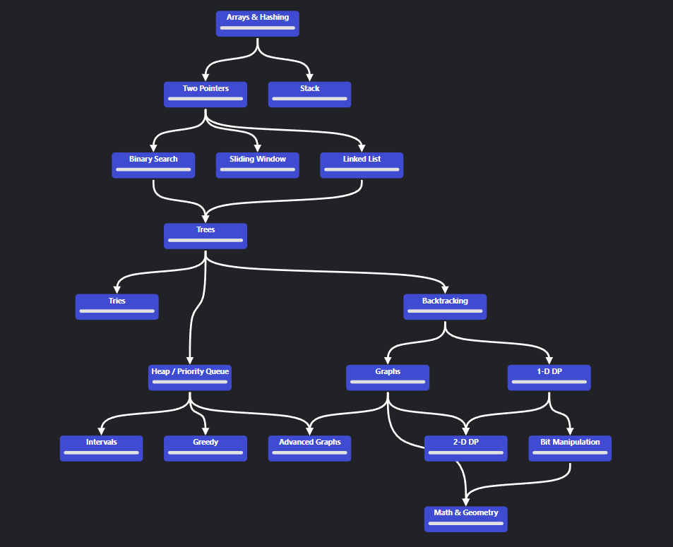

# Coding Interview Diary

## What's This?

This is a structured diary documenting my **Coding Interview Preparation**, following the proven [NeetCode](https://neetcode.io/roadmap) Roadmap methodology. Each topic and problem is analyzed systematically with detailed explanations and solutions.

---

## What You'll Find Here

This diary is organized by major topics for Software Engineering interviews, including:
- **Data Structures & Algorithms** - Arrays, Strings, Linked Lists, Trees, Graphs, Heaps, Hash Tables, etc.
- **System Design** - High-level design, scalability, and architecture and most important concepts like load balancing, caching, database sharding, etc.
- **AI & ML** - Machine Learning, Deep Learning, and AI Agents. How to use them effectively in real-world applications.
- **Frontend Engineering** - React, Angular, Vue, and other frontend frameworks.

Each section of DSA topic includes comprehensive coverage:

- **Topic Explanations** - Core concepts and foundational algorithms
- **Useful Methods** - Essential functions and techniques for each pattern
- **Problem Statements** - Clear problem descriptions and requirements
- **Initial Analysis** - Deep-dive analysis before coding
- **Python & Java Solutions** - Multiple language implementations
- **Complexity Analysis** - Time and space complexity estimations

---

## Why NeetCode?

NeetCode focuses on **patterns** rather than random problems. This approach:

- Builds systematic problem-solving skills
- Reduces randomness in interview prep
- Emphasizes reusable patterns across multiple problems
- Focuses on the most frequently asked interview topics

---

## My Structured Approach

### Problem-Solving Strategy

For each problem, I follow this Three-Step Process:

**Step 1: Analyze First**

- Identify problem type and constraints
- Think about edge cases
- Think about possible clarifying questions

**Step 2: Naive to Optimal**

- Walk through the naive solution
- Identify weaknesses
- Recognize the pattern
- Draft optimal solution

**Step 3: Pure Problem Solving**

- No hints, no solutions, no AI to implement the solution
- Checking common commands or syntax is fine as I'm going back and forth between Python and Java
- Implement the solution from scratch in around 10 minutes (easy), 30 minutes (medium), 60 minutes (hard)
- If I'm stuck after this time, gradually check hints and solutions

**Step 4: Look back and analyze**
- What made me struggle the most?
- Can the solution be improved further?
- Which follow-up questions can be asked?
- Here, AI can be used to answer these questions and provide additional insights
---

*Last updated: July 2026*